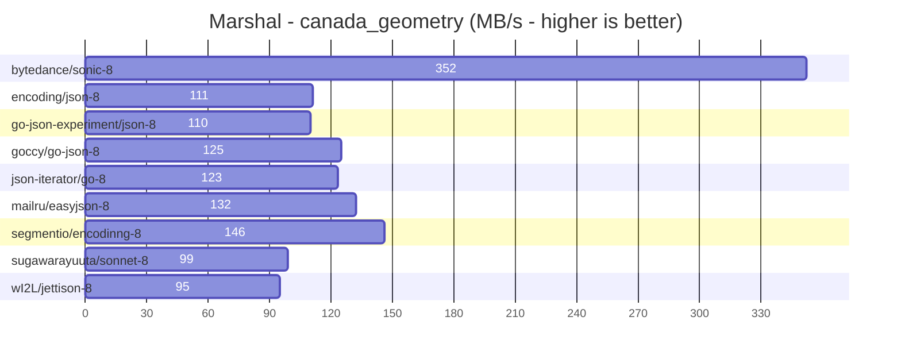
```mermaid
gantt
title Marshal - canada_geometry (MB/s - higher is better)
dateFormat X
axisFormat %s

section bytedance/sonic-8                 
352 :0, 352
section encoding/json-8         
111 :0, 111
section go-json-experiment/json-8         
110 :0, 110
section goccy/go-json-8                   
125 :0, 125
section json-iterator/go-8                
123 :0, 123
section mailru/easyjson-8                 
132 :0, 132
section segmentio/encodinng-8             
146 :0, 146
section sugawarayuuta/sonnet-8            
99 :0, 99
section wI2L/jettison-8                   
95 :0, 95
```

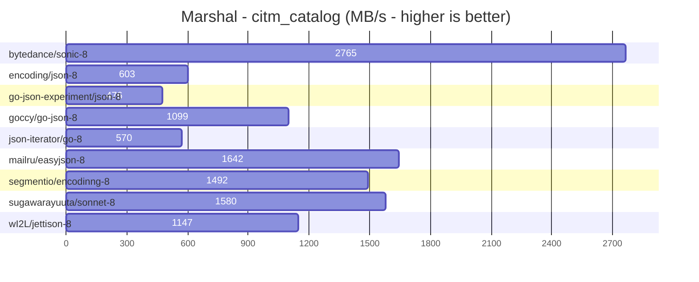
```mermaid
gantt
title Marshal - citm_catalog (MB/s - higher is better)
dateFormat X
axisFormat %s

section bytedance/sonic-8                    
2765 :0, 2765
section encoding/json-8                      
603 :0, 603
section go-json-experiment/json-8            
476 :0, 476
section goccy/go-json-8                      
1099 :0, 1099
section json-iterator/go-8                   
570 :0, 570
section mailru/easyjson-8                    
1642 :0, 1642
section segmentio/encodinng-8                
1492 :0, 1492
section sugawarayuuta/sonnet-8               
1580 :0, 1580
section wI2L/jettison-8                      
1147 :0, 1147
```

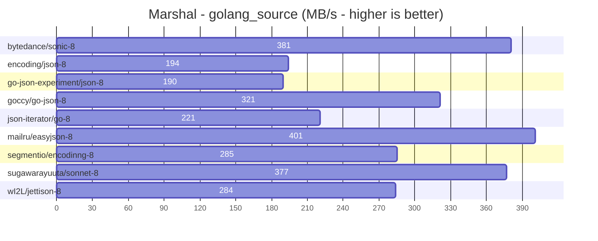
```mermaid
gantt
title Marshal - golang_source (MB/s - higher is better)
dateFormat X
axisFormat %s

section bytedance/sonic-8                   
381 :0, 381
section encoding/json-8                     
194 :0, 194
section go-json-experiment/json-8           
190 :0, 190
section goccy/go-json-8                     
321 :0, 321
section json-iterator/go-8                  
221 :0, 221
section mailru/easyjson-8                   
401 :0, 401
section segmentio/encodinng-8               
285 :0, 285
section sugawarayuuta/sonnet-8              
377 :0, 377
section wI2L/jettison-8                     
284 :0, 284
```

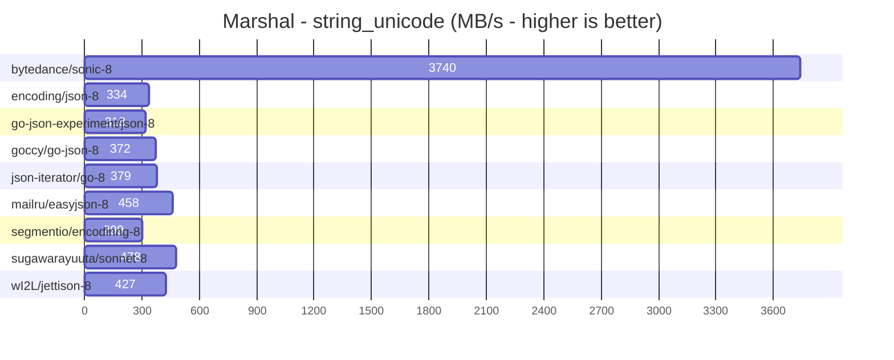
```mermaid
gantt
title Marshal - string_unicode (MB/s - higher is better)
dateFormat X
axisFormat %s

section bytedance/sonic-8                  
3740 :0, 3740
section encoding/json-8                    
334 :0, 334
section go-json-experiment/json-8          
318 :0, 318
section goccy/go-json-8                    
372 :0, 372
section json-iterator/go-8                 
379 :0, 379
section mailru/easyjson-8                  
458 :0, 458
section segmentio/encodinng-8              
299 :0, 299
section sugawarayuuta/sonnet-8             
478 :0, 478
section wI2L/jettison-8                    
427 :0, 427
```

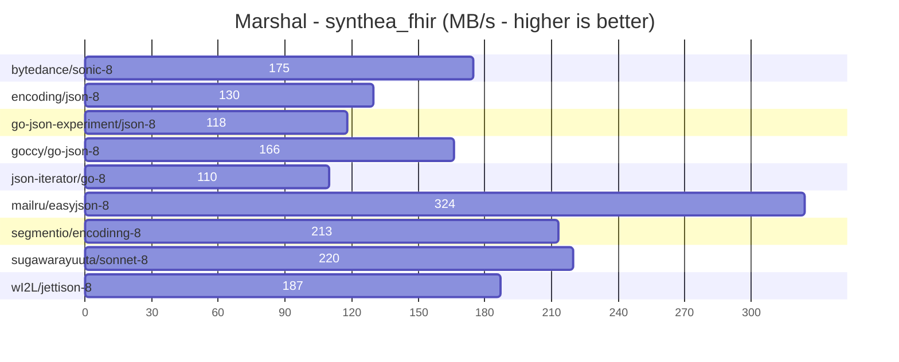
```mermaid
gantt
title Marshal - synthea_fhir (MB/s - higher is better)
dateFormat X
axisFormat %s

section bytedance/sonic-8                    
175 :0, 175
section encoding/json-8                      
130 :0, 130
section go-json-experiment/json-8            
118 :0, 118
section goccy/go-json-8                      
166 :0, 166
section json-iterator/go-8                   
110 :0, 110
section mailru/easyjson-8                    
324 :0, 324
section segmentio/encodinng-8                
213 :0, 213
section sugawarayuuta/sonnet-8               
220 :0, 220
section wI2L/jettison-8                      
187 :0, 187
```

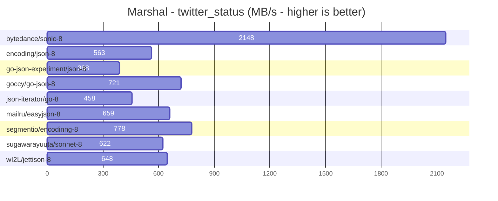
```mermaid
gantt
title Marshal - twitter_status (MB/s - higher is better)
dateFormat X
axisFormat %s

section bytedance/sonic-8                  
2148 :0, 2148
section encoding/json-8                    
563 :0, 563
section go-json-experiment/json-8          
388 :0, 388
section goccy/go-json-8                    
721 :0, 721
section json-iterator/go-8                 
458 :0, 458
section mailru/easyjson-8                  
659 :0, 659
section segmentio/encodinng-8              
778 :0, 778
section sugawarayuuta/sonnet-8             
622 :0, 622
section wI2L/jettison-8                    
648 :0, 648
```

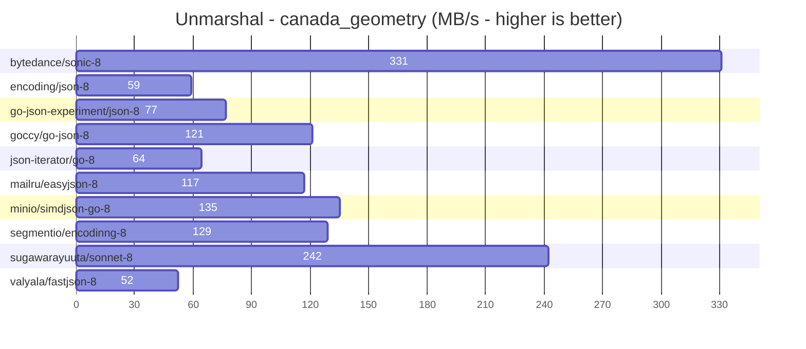
```mermaid
gantt
title Unmarshal - canada_geometry (MB/s - higher is better)
dateFormat X
axisFormat %s

section bytedance/sonic-8               
331 :0, 331
section encoding/json-8                 
59 :0, 59
section go-json-experiment/json-8       
77 :0, 77
section goccy/go-json-8                 
121 :0, 121
section json-iterator/go-8              
64 :0, 64
section mailru/easyjson-8               
117 :0, 117
section minio/simdjson-go-8             
135 :0, 135
section segmentio/encodinng-8           
129 :0, 129
section sugawarayuuta/sonnet-8          
242 :0, 242
section valyala/fastjson-8              
52 :0, 52
```

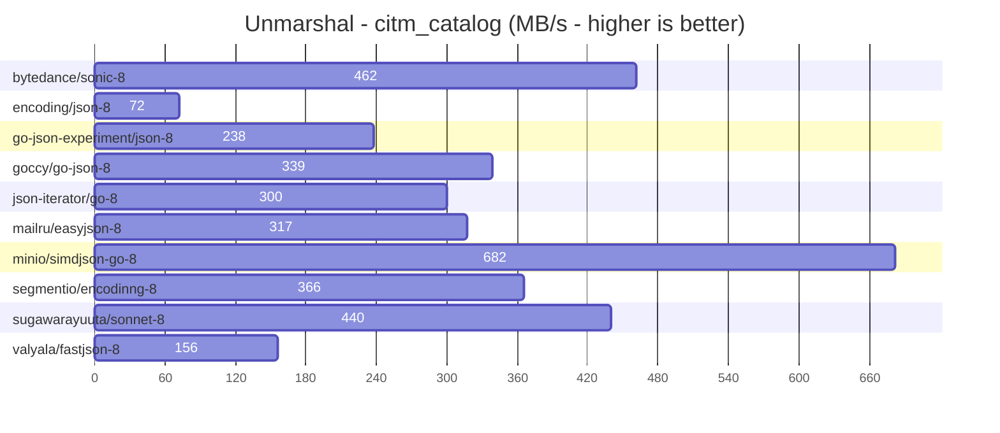
```mermaid
gantt
title Unmarshal - citm_catalog (MB/s - higher is better)
dateFormat X
axisFormat %s

section bytedance/sonic-8                  
462 :0, 462
section encoding/json-8                    
72 :0, 72
section go-json-experiment/json-8          
238 :0, 238
section goccy/go-json-8                    
339 :0, 339
section json-iterator/go-8                 
300 :0, 300
section mailru/easyjson-8                  
317 :0, 317
section minio/simdjson-go-8                
682 :0, 682
section segmentio/encodinng-8              
366 :0, 366
section sugawarayuuta/sonnet-8             
440 :0, 440
section valyala/fastjson-8                 
156 :0, 156
```

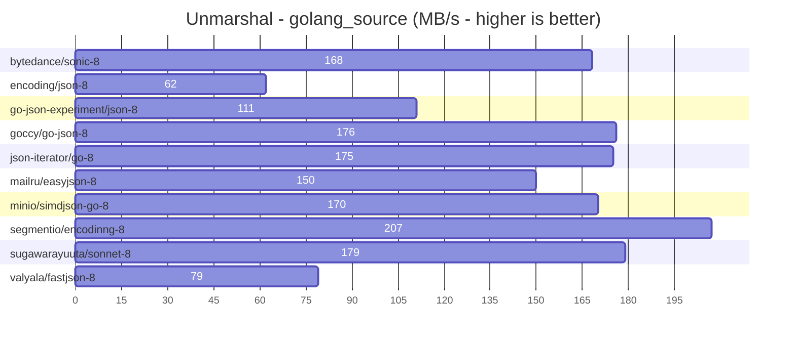
```mermaid
gantt
title Unmarshal - golang_source (MB/s - higher is better)
dateFormat X
axisFormat %s

section bytedance/sonic-8                 
168 :0, 168
section encoding/json-8                   
62 :0, 62
section go-json-experiment/json-8         
111 :0, 111
section goccy/go-json-8                   
176 :0, 176
section json-iterator/go-8                
175 :0, 175
section mailru/easyjson-8                 
150 :0, 150
section minio/simdjson-go-8               
170 :0, 170
section segmentio/encodinng-8             
207 :0, 207
section sugawarayuuta/sonnet-8            
179 :0, 179
section valyala/fastjson-8                
79 :0, 79
```

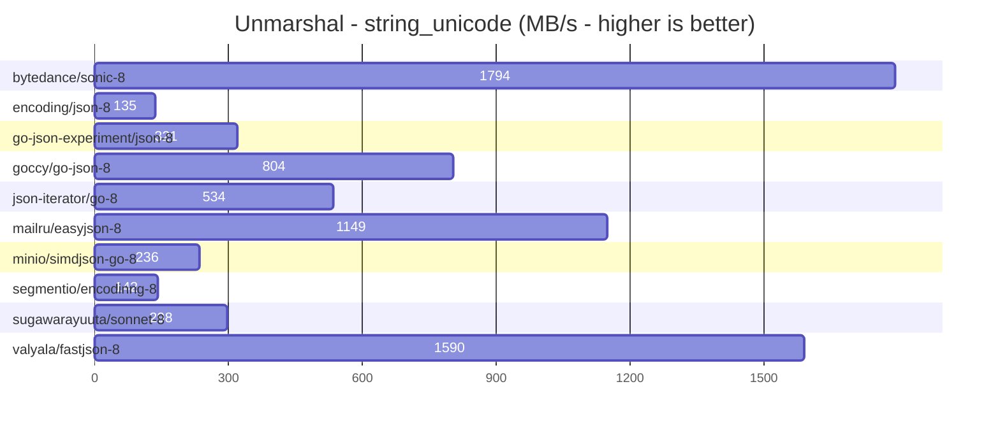
```mermaid
gantt
title Unmarshal - string_unicode (MB/s - higher is better)
dateFormat X
axisFormat %s

section bytedance/sonic-8                
1794 :0, 1794
section encoding/json-8                  
135 :0, 135
section go-json-experiment/json-8        
321 :0, 321
section goccy/go-json-8                  
804 :0, 804
section json-iterator/go-8               
534 :0, 534
section mailru/easyjson-8                
1149 :0, 1149
section minio/simdjson-go-8              
236 :0, 236
section segmentio/encodinng-8            
142 :0, 142
section sugawarayuuta/sonnet-8           
298 :0, 298
section valyala/fastjson-8               
1590 :0, 1590
```

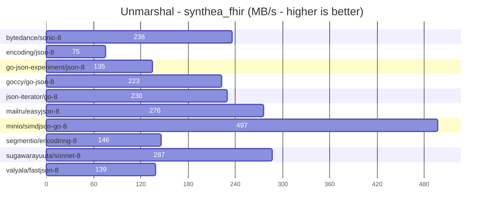
```mermaid
gantt
title Unmarshal - synthea_fhir (MB/s - higher is better)
dateFormat X
axisFormat %s

section bytedance/sonic-8                  
236 :0, 236
section encoding/json-8                    
75 :0, 75
section go-json-experiment/json-8          
135 :0, 135
section goccy/go-json-8                    
223 :0, 223
section json-iterator/go-8                 
230 :0, 230
section mailru/easyjson-8                  
276 :0, 276
section minio/simdjson-go-8                
497 :0, 497
section segmentio/encodinng-8              
146 :0, 146
section sugawarayuuta/sonnet-8             
287 :0, 287
section valyala/fastjson-8                 
139 :0, 139
```

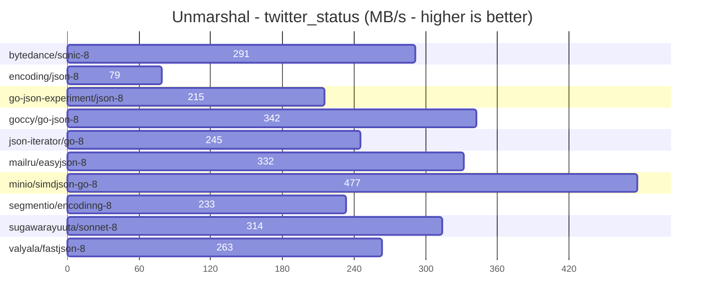
```mermaid
gantt
title Unmarshal - twitter_status (MB/s - higher is better)
dateFormat X
axisFormat %s

section bytedance/sonic-8                
291 :0, 291
section encoding/json-8                  
79 :0, 79
section go-json-experiment/json-8        
215 :0, 215
section goccy/go-json-8                  
342 :0, 342
section json-iterator/go-8               
245 :0, 245
section mailru/easyjson-8                
332 :0, 332
section minio/simdjson-go-8              
477 :0, 477
section segmentio/encodinng-8            
233 :0, 233
section sugawarayuuta/sonnet-8           
314 :0, 314
section valyala/fastjson-8               
263 :0, 263
```

