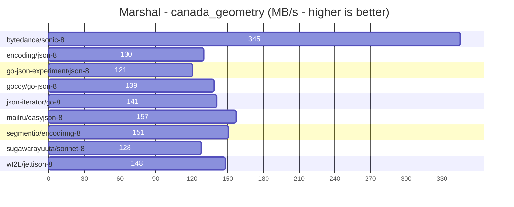
```mermaid
gantt
title Marshal - canada_geometry (MB/s - higher is better)
dateFormat X
axisFormat %s

section bytedance/sonic-8                 
345 :0, 345
section encoding/json-8         
130 :0, 130
section go-json-experiment/json-8         
121 :0, 121
section goccy/go-json-8                   
139 :0, 139
section json-iterator/go-8                
141 :0, 141
section mailru/easyjson-8                 
157 :0, 157
section segmentio/encodinng-8             
151 :0, 151
section sugawarayuuta/sonnet-8            
128 :0, 128
section wI2L/jettison-8                   
148 :0, 148
```

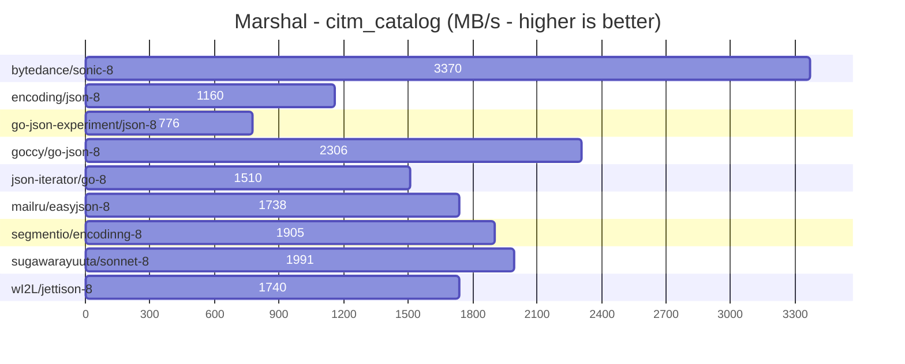
```mermaid
gantt
title Marshal - citm_catalog (MB/s - higher is better)
dateFormat X
axisFormat %s

section bytedance/sonic-8                    
3370 :0, 3370
section encoding/json-8                      
1160 :0, 1160
section go-json-experiment/json-8            
776 :0, 776
section goccy/go-json-8                      
2306 :0, 2306
section json-iterator/go-8                   
1510 :0, 1510
section mailru/easyjson-8                    
1738 :0, 1738
section segmentio/encodinng-8                
1905 :0, 1905
section sugawarayuuta/sonnet-8               
1991 :0, 1991
section wI2L/jettison-8                      
1740 :0, 1740
```

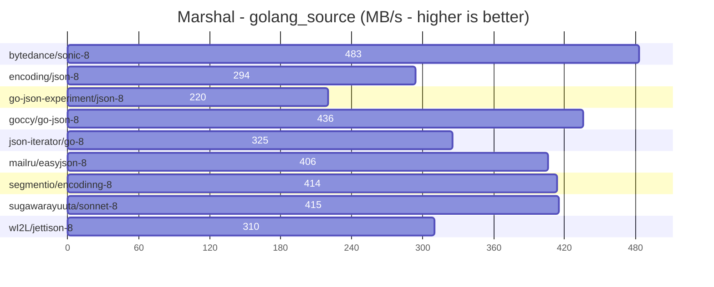
```mermaid
gantt
title Marshal - golang_source (MB/s - higher is better)
dateFormat X
axisFormat %s

section bytedance/sonic-8                   
483 :0, 483
section encoding/json-8                     
294 :0, 294
section go-json-experiment/json-8           
220 :0, 220
section goccy/go-json-8                     
436 :0, 436
section json-iterator/go-8                  
325 :0, 325
section mailru/easyjson-8                   
406 :0, 406
section segmentio/encodinng-8               
414 :0, 414
section sugawarayuuta/sonnet-8              
415 :0, 415
section wI2L/jettison-8                     
310 :0, 310
```

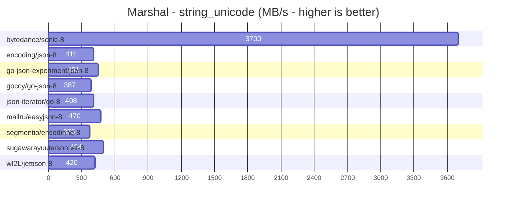
```mermaid
gantt
title Marshal - string_unicode (MB/s - higher is better)
dateFormat X
axisFormat %s

section bytedance/sonic-8                  
3700 :0, 3700
section encoding/json-8                    
411 :0, 411
section go-json-experiment/json-8          
451 :0, 451
section goccy/go-json-8                    
387 :0, 387
section json-iterator/go-8                 
408 :0, 408
section mailru/easyjson-8                  
470 :0, 470
section segmentio/encodinng-8              
376 :0, 376
section sugawarayuuta/sonnet-8             
494 :0, 494
section wI2L/jettison-8                    
420 :0, 420
```

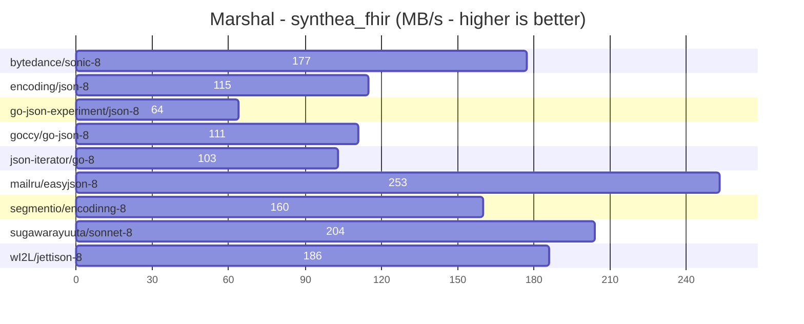
```mermaid
gantt
title Marshal - synthea_fhir (MB/s - higher is better)
dateFormat X
axisFormat %s

section bytedance/sonic-8                    
177 :0, 177
section encoding/json-8                      
115 :0, 115
section go-json-experiment/json-8            
64 :0, 64
section goccy/go-json-8                      
111 :0, 111
section json-iterator/go-8                   
103 :0, 103
section mailru/easyjson-8                    
253 :0, 253
section segmentio/encodinng-8                
160 :0, 160
section sugawarayuuta/sonnet-8               
204 :0, 204
section wI2L/jettison-8                      
186 :0, 186
```

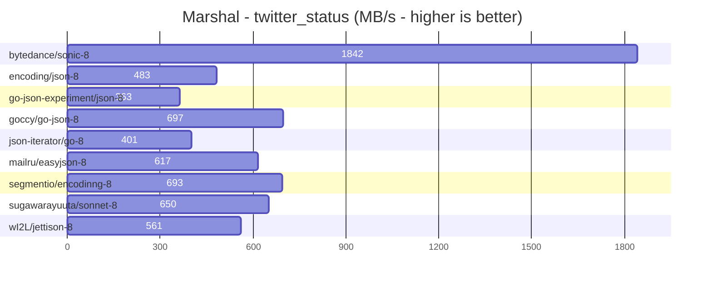
```mermaid
gantt
title Marshal - twitter_status (MB/s - higher is better)
dateFormat X
axisFormat %s

section bytedance/sonic-8                  
1842 :0, 1842
section encoding/json-8                    
483 :0, 483
section go-json-experiment/json-8          
363 :0, 363
section goccy/go-json-8                    
697 :0, 697
section json-iterator/go-8                 
401 :0, 401
section mailru/easyjson-8                  
617 :0, 617
section segmentio/encodinng-8              
693 :0, 693
section sugawarayuuta/sonnet-8             
650 :0, 650
section wI2L/jettison-8                    
561 :0, 561
```

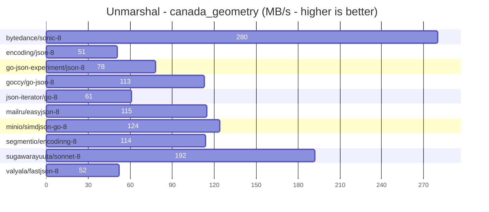
```mermaid
gantt
title Unmarshal - canada_geometry (MB/s - higher is better)
dateFormat X
axisFormat %s

section bytedance/sonic-8               
280 :0, 280
section encoding/json-8                 
51 :0, 51
section go-json-experiment/json-8       
78 :0, 78
section goccy/go-json-8                 
113 :0, 113
section json-iterator/go-8              
61 :0, 61
section mailru/easyjson-8               
115 :0, 115
section minio/simdjson-go-8             
124 :0, 124
section segmentio/encodinng-8           
114 :0, 114
section sugawarayuuta/sonnet-8          
192 :0, 192
section valyala/fastjson-8              
52 :0, 52
```

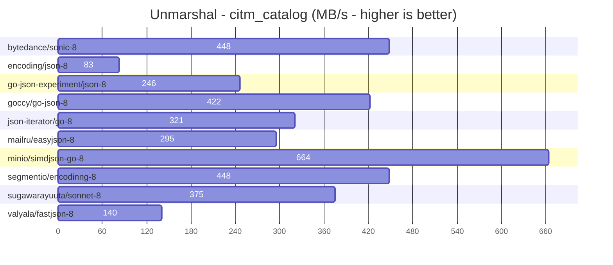
```mermaid
gantt
title Unmarshal - citm_catalog (MB/s - higher is better)
dateFormat X
axisFormat %s

section bytedance/sonic-8                  
448 :0, 448
section encoding/json-8                    
83 :0, 83
section go-json-experiment/json-8          
246 :0, 246
section goccy/go-json-8                    
422 :0, 422
section json-iterator/go-8                 
321 :0, 321
section mailru/easyjson-8                  
295 :0, 295
section minio/simdjson-go-8                
664 :0, 664
section segmentio/encodinng-8              
448 :0, 448
section sugawarayuuta/sonnet-8             
375 :0, 375
section valyala/fastjson-8                 
140 :0, 140
```

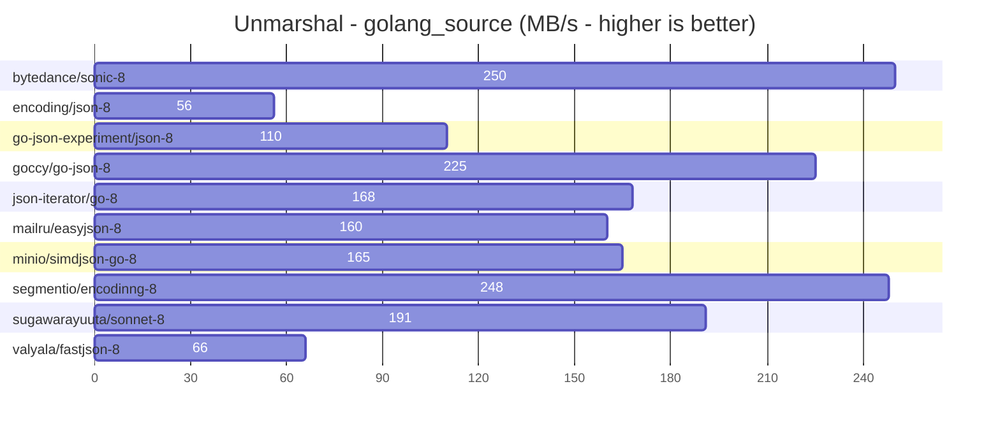
```mermaid
gantt
title Unmarshal - golang_source (MB/s - higher is better)
dateFormat X
axisFormat %s

section bytedance/sonic-8                 
250 :0, 250
section encoding/json-8                   
56 :0, 56
section go-json-experiment/json-8         
110 :0, 110
section goccy/go-json-8                   
225 :0, 225
section json-iterator/go-8                
168 :0, 168
section mailru/easyjson-8                 
160 :0, 160
section minio/simdjson-go-8               
165 :0, 165
section segmentio/encodinng-8             
248 :0, 248
section sugawarayuuta/sonnet-8            
191 :0, 191
section valyala/fastjson-8                
66 :0, 66
```

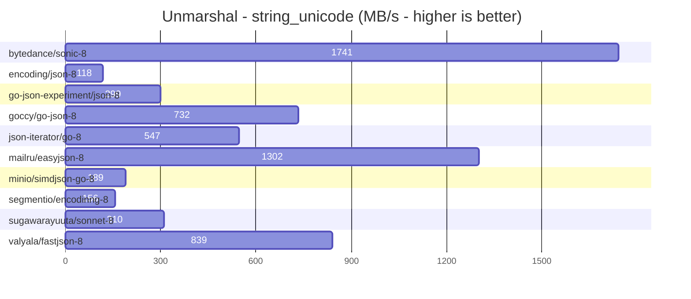
```mermaid
gantt
title Unmarshal - string_unicode (MB/s - higher is better)
dateFormat X
axisFormat %s

section bytedance/sonic-8                
1741 :0, 1741
section encoding/json-8                  
118 :0, 118
section go-json-experiment/json-8        
299 :0, 299
section goccy/go-json-8                  
732 :0, 732
section json-iterator/go-8               
547 :0, 547
section mailru/easyjson-8                
1302 :0, 1302
section minio/simdjson-go-8              
189 :0, 189
section segmentio/encodinng-8            
156 :0, 156
section sugawarayuuta/sonnet-8           
310 :0, 310
section valyala/fastjson-8               
839 :0, 839
```

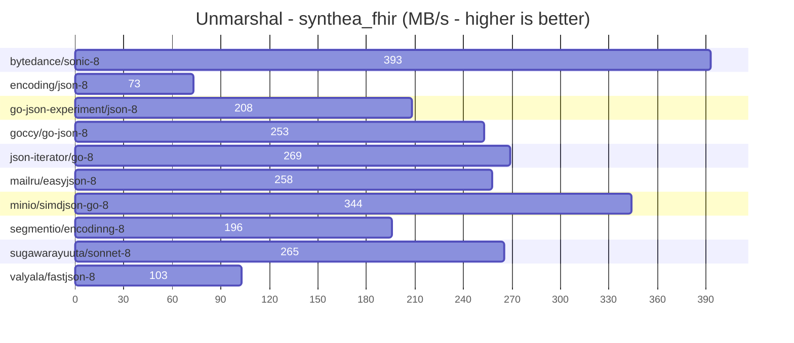
```mermaid
gantt
title Unmarshal - synthea_fhir (MB/s - higher is better)
dateFormat X
axisFormat %s

section bytedance/sonic-8                  
393 :0, 393
section encoding/json-8                    
73 :0, 73
section go-json-experiment/json-8          
208 :0, 208
section goccy/go-json-8                    
253 :0, 253
section json-iterator/go-8                 
269 :0, 269
section mailru/easyjson-8                  
258 :0, 258
section minio/simdjson-go-8                
344 :0, 344
section segmentio/encodinng-8              
196 :0, 196
section sugawarayuuta/sonnet-8             
265 :0, 265
section valyala/fastjson-8                 
103 :0, 103
```

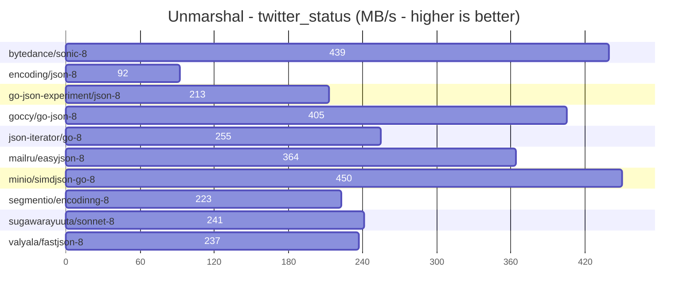
```mermaid
gantt
title Unmarshal - twitter_status (MB/s - higher is better)
dateFormat X
axisFormat %s

section bytedance/sonic-8                
439 :0, 439
section encoding/json-8                  
92 :0, 92
section go-json-experiment/json-8        
213 :0, 213
section goccy/go-json-8                  
405 :0, 405
section json-iterator/go-8               
255 :0, 255
section mailru/easyjson-8                
364 :0, 364
section minio/simdjson-go-8              
450 :0, 450
section segmentio/encodinng-8            
223 :0, 223
section sugawarayuuta/sonnet-8           
241 :0, 241
section valyala/fastjson-8               
237 :0, 237
```

